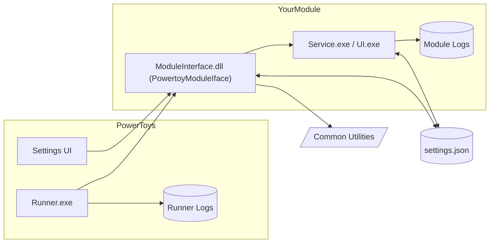

Great work Jaylyn, this is going to help so many people and make it easier for folks to contribute!

# 🧭 Creating a New PowerToy: End-to-End Developer Guide

This guide documents the process of building a new PowerToys utility from scratch—including architecture decisions, integration steps, and common pitfalls. It is designed to capture real-world lessons learned from developing modules like **LightSwitch**.

JNOTE: Recommend to add a thanks for them wanting to contribute to PowerToys

JNOTE: Recommend to add diagrams to help visual folks understand, you can use Mermaid, example below:



---

## 1. Overview and Prerequisites

A PowerToy module is a self-contained utility integrated into the PowerToys ecosystem. It can be UI-based, service-based, or both.

### Requirements
JNOTE: recommend to add links to the tools and 
* Visual Studio 2022 (Desktop & C++ workloads)
* .NET 8 SDK
* WiX v5 toolset
* PowerToys repository cloned locally
* Able to build and run `PowerToys.sln`

### Folder Structure

```
src/
  modules/
    your_module/
      YourModule.sln
      YourModuleInterface/
      YourModuleUI/ (if needed)
      YourModuleService/ (if needed)
```

---
## 2. Design and Planning

### Decide the Type of Module
Think about how your module works and which existing modules behave similarly. You are going to want to think about the UI needed for the application, the lifecycle, whether it is a service that is always running or event based. Below are some basic scenarios with some modules to explore. You can write your application in C++ or C#.
* **UI-only:** e.g., ColorPicker
* **Background service:** e.g., LightSwitch, Awake
* **Hybrid (UI + background logic):** e.g., ShortcutGuide
* **C++/C# interop:** e.g., PowerRename 

### Writing your Module Interface
JNOTE: Recommend to add more context that that your module can use/create funationlaity from other modules 
Below are the key headers in the Module Interface (dllmain.cpp) and their purpose:
1. This is where you will define all of the module settings. These can be any type from strings, bools, ints, and even custom Enums.
```c++
struct ModuleSettings {};
```

2. This is the header for the full class. It inherits the PowerToyModuleIface
```c++
class ModuleInterface : public PowerToyModuleIface 
{
  private:
    // the private members of the class
    // Can include the enabled variable, logic for event handlers, or hotkeys.
  public:
    // the public members of the class
    // Will include the constructor and intialization logic.
}
```

> Note: Many of the class functions are boilerplate and need simple string replacements with your module name. The rest of the functions below will require bigger changes.

3. GPO rule, this will require you to follow the `powertoys_gpo` object and set up the `getConfiguredModuleEnabledValue`
```c++
virtual powertoys_gpo::gpo_rule_configured_t gpo_policy_enabled_configuration() override
{
    return powertoys_gpo::getConfiguredModuleEnabledValue();
}
```
JNOTE: Can you add a note about what GPO is
JNOTE: I'm not sure where these go, is there best practices? 

4. `init_settings()` initializes the settings for the interface. Will either pull from exisiting settings.json or use defaults.
```c++
void ModuleInterface::init_settings()
```

5. `get_config` retrieves the settings from the settings.json file.
```c++
virtual bool get_config(wchar_t* buffer, int* buffer_size) override
```

6. `set_config` sets the new settings to the settings.json file.
```c++
virtual void set_config(const wchar_t* config) override
```

7. `call_custom_action` allows custom actions to be called based on signals from the settings app.
```c++
void call_custom_action(const wchar_t* action) override
```

8. Lifecycle events control the whether the module is enabled or not as well as the default status of the module.
```c++
virtual void enable() // starts the module
virtual void disable() // terminates the module and performs any cleanup
virtual bool is_enabled() // returns if the module is currently enabled
virtual bool is_enabled_by_default() const override // allows the module to dictate whether it should be enabled by default in the PowerToys app.
```

9. Hotkey functions control the status of the hotkey.

JNOTE: The code color syntix isn't working for `get_hotkeys` and `on_hotkey`
```c++
void parse_hotkey(PowerToysSettings::PowerToyValues& settings) // takes the hotkey from settings into a format the interface can understand
virtual size_t get_hotkeys(Hotkey* hotkeys, size_t buffer_size) override // returns the hotkeys from settings
virtual bool on_hotkey(size_t hotkeyId) override // performs logic when the hotkey event is fired
```

### Notes
* Keep module logic isolated under `/modules/<YourModule>`
* Use shared utilities from `/common/` instead of cross-module dependencies
* init/set/get config use preset functions to access the settings. Check out the [`settings_objects.h`](../../../rc/common/SettingsAPI/settings_objects.h) in `src\common\SettingsAPI`

JNOTE: Double check my hyperlink above

---
## 3. Bootstrapping Your Module

JNOTE: Is it worth having a template for the 4 different types?
1. **Copy a similar module folder** (e.g., `Awake`) as a template.
2. Rename projects and namespaces.
4. Update GUIDs in `.vcxproj` and solution files.

JNOTE: Can we assume devs know how to do this? recommend to add a link on how to do this 
6. Fill in functions mentioned in the above section.

JNOTE: Shouldn't it be "update" vs "Fill in"?

8. Register your module in the PowerToys runner. (Hint: Search for all instances of other modules and slot your module in. e.g.: search "Awake" and make sure your module is in every list where Awake is.)

JNOTE: how does one register the module? 
    * `src/runner/modules.h`
    * `src/runner/modules.cpp`
    * `src/runner/resource.h`
    * `src/runner/settings_window.h`
    * `src/runner/settings_window.cpp`
    * `src/runner/main.cpp`
    * `src/common/logger.h` (for logging)
10. ModuleInterface should build your ModuleInterface.dll. This will allow the runner to interact with your service.

> **Gotcha:** Mismatched module IDs are one of the most common causes of load failures. Keep your ID consistent across manifest, registry, and service.

---
## 4. Write your service
This is going to look different for every PowerToy. It may be easier to develop the application independently then link in the PowerToys settings logic later. But you have to write the service first before connecting it to the runner.

### Notes
* Set the service icon using the `.rc` file.
* Set the service name in the `.vcxproj` by setting the `<TargetName>`
```
<PropertyGroup>
  <OutDir>..\..\..\..\$(Platform)\$(Configuration)\$(MSBuildProjectName)\</OutDir>
  <TargetName>PowerToys.LightSwitchService</TargetName>
</PropertyGroup>
```
* To view the code of the `.vcxproj` right click the item and press `Unload project`
* Use the following functions to interact with settings from your service
```
ModuleSettings::instance().InitFileWatcher();
ModuleSettings::instance().LoadSettings();
auto& settings = ModuleSettings::instance().settings();
```
These come from a ModuleSettings.h file that lives with the Service. You can copy this from another module (e.g., Light Switch) and adjust to fit your needs. JNOTE: Shouldn't that be in the copied files?

If your module has a visual interface:
* Use **WinUI 3** Desktop templates
* Follow PowerToys conventions for theming, icons, and accessibility
JNOTE: FOr conventions is there a file that contians this or are you suggesting to review other powertoys to see how they handeled these items?
* Connect settings via `ViewModel` pattern

JNOTE: not sure what you mean by `ViewModel` pattern, are you talking about MVVM or a particular ViewModel file (pattern?)?  
## 5. Settings Integration

PowerToys settings are stored per-module as JSON under:

```
%LOCALAPPDATA%\Microsoft\PowerToys\<module>\settings.json
```

### Implementation Steps

JNOTE: I think adding a small diagram of the releationship betwen Properties and Settings would be helpful

* In `src\settings-ui\Settings.UI.Library\` create `<module>Properties.cs` and `<module>Settings.cs`
* `<module>Properties.cs` is where you will define your defaults. Every setting needs to be represented here. This should match what was set in the Module Interface.
* `<module>Settings.cs`is where your settings.json will be built from. The structure should match the following:
```cs
public ModuleSettings()
{
    Name = ModuleName;
    Version = Assembly.GetExecutingAssembly().GetName().Version.ToString();
    Properties = new ModuleProperties(); // settings properties you set above.
}
```
* In `src\settings-ui\Settings.UI\ViewModels` create `<module>ViewModel.cs` this is where the interaction happens between your settings page in the PowerToys app and the settings file that is stored on the device. Changes here will trigger the settings watcher via a `NotifyPropertyChanged` event.
* Create a `SettingsPage.xaml` at `src\settings-ui\Settings.UI\SettingsXAML\Views` this will be how the user interacts with the settings of your module.
* Be sure to use resource strings for user facing strings so they can later be localized. (x:Uid connects to Resources.resw)
```xaml
// LightSwitch.xaml
<ComboBoxItem
    x:Uid="LightSwitch_ModeOff"
    AutomationProperties.AutomationId="OffCBItem_LightSwitch"
    Tag="Off" />

// Resources.resw
<data name="LightSwitch_ModeOff.Content" xml:space="preserve">
  <value>Off</value>
</data>
```
> Note: in the above example we use `.Content` to target the content of the Combobox. This can change per UI element (e.g., `.Text`, `.Header`, etc.)

> **Reminder:** Manual edits in external editors (VS Code, Notepad++) do **not** trigger the settings watcher. Only changes written through PowerToys trigger reloads.

---

### Gotchas:
* Only use the WinUI 3 Desktop framework, not UWP.
* Use [`DispatcherQueue`](https://learn.microsoft.com/en-us/windows/apps/develop/dispatcherqueue) when updating UI from non-UI threads.

---
## 6. Building and Debugging
### Debugging steps
1. If this is your first time debugging PowerToys be sure to follow [these steps first](https://github.com/microsoft/PowerToys/blob/main/doc/devdocs/development/debugging.md#pre-debugging-setup).
2. Set "runner" as the start up project and ensure your build configuration is set to match your system (ARM64/x64)
3. Press `F5` or the "Local Windows Debugger" button to begin debugging. This should start the PowerToys runner.
4. To set breakpoints in your service, press `Ctrl + Alt + P` and search for your service to attach to the runner.
5. Use logs to document changes. The logs live at `%LOCALAPPDATA%\Microsoft\PowerToys\RunnerLogs` and `%LOCALAPPDATA%\Microsoft\PowerToys\Module\Service\<version>` for the specific module.

> **Gotcha:** PowerToys caches `.nuget` artifacts aggressively. Use `git clean -xfd` when builds behave unexpectedly.
---
## 7. Installer and Packaging (WiX)

### Add Your Module to Installer

1. Install [`WixToolset.Heat`](https://www.nuget.org/packages/WixToolset.Heat/) for Wix5 via nuget
2. Inside `installer\PowerToysInstallerVNext` add a new file for your module: `Module.wxs`

JNOTE: Isn't that already there from the coping of another module? 
4. Inside of this file you will need copy the format from another module (ie: Light Switch) and replace the strings and GUID values.
5. The key part will be `<!--LightSwitchFiles_Component_Def-->` which is a placeholder for code that will be generated by `generateFileComponents.ps1`.

JNOTE: Shouldn't it be `<!--MODULENAMEFiles_Component_Def-->`? Also not really sure what is meant here. 
7. Inside `Product.wxs` add a line item in the `<Feature Id="CoreFeature" ... >` section. It will look like a list of ` <ComponentGroupRef Id="ModuleComponentGroup" />` items.
8. Inside `generateFileComponents.ps1` you will need to add an entry to the bottom for your new module. It will follow the following format. `-fileListName <Module>Files` will match the string you set in `Module.wxs`, `<ModuleServiceName>` will match the name of your exe.
```bash
# Module Name
Generate-FileList -fileDepsJson "" -fileListName <Module>Files -wxsFilePath $PSScriptRoot\<Module>.wxs -depsPath "$PSScriptRoot..\..\..\$platform\Release\<ModuleServiceName>"
Generate-FileComponents -fileListName "<Module>Files" -wxsFilePath $PSScriptRoot\<Module>.wxs -regroot $registryroot
```
---
## 8. Testing and Validation

### UI Tests
* Place under `/modules/<YourModule>/Tests`
* Create new [WinUI Unit Test App](https://learn.microsoft.com/en-us/windows/apps/winui/winui3/testing/create-winui-unit-test-project)
* Write unit tests following format from previous modules (ie: Light Switch). This can be to test your standalone UI (if you're a module like Color Picker) or to verify that the Settings UI in the PowerToys app is controlling your service.

### Manual Validation
* Enable/disable in PowerToys Settings
* Check initialization in logs
* Confirm icons, tooltips, and OOBE page appear correctly

JNOTE: Consider explaining what OOBE stands for (Out-of-Box Experience) for clarity

### Pro Tips:
1. Validate wake/sleep and elevation states. Background modules often fail silently after resume if event handles aren’t recreated.
2. Use Windows Sandbox to simulate clean install environments
3. To simulate a "new user" you can delete the PowerToys folder from `%LOCALAPPDATA%\Microsoft`
---
## 9. OOBE page
The OOBE page is a custom settings page that shows off the module in the OOBE experience. This Window opens first before the Settings application and allows the user to learn about each module at a glance. Create `OOBE<ModuleName>.xaml` at ` src\settings-ui\Settings.UI\SettingsXAML\OOBE\Views`. You will also need to add your module name to the enum at `src\settings-ui\Settings.UI\OOBE\Enums\PowerToysModules.cs`

JNOTE: Recommend to add a thank for you their contributions and maybe a link to how to get help 
